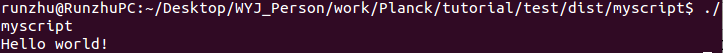
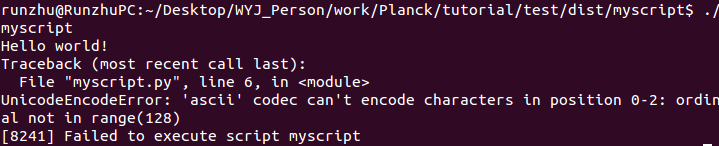
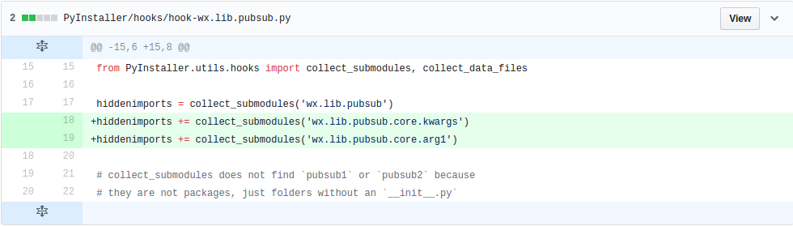
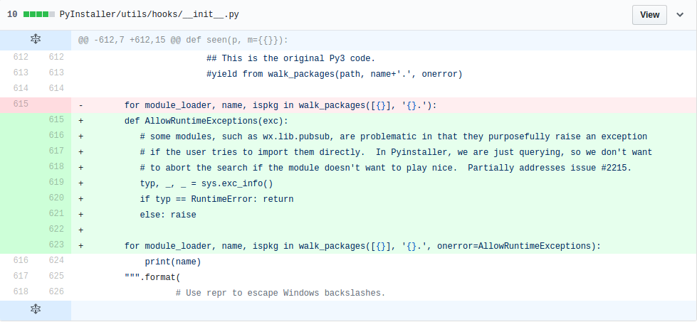
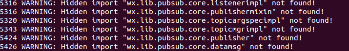

## Pyinstaller简介
## Pyinstaller安装
## Pyinstaller常规使用说明
## GUI2打包及注意事项


---

### Pyinstaller简介
PyInstaller将Python应用程序及其所有依赖项打包到一个文件夹或文件中，打包完的程序就可以在没有安装Python解释器或依赖的机器上运行了。Pyinstaller通过读取你编写的python脚本，分析你的代码去收集每一个需要的模块和库，包括python解释器，并将它们复制下来后与你的python脚本放在单个文件夹或单个可执行文件中．
PyInstaller支持Python 2.7和Python 3.3-3.6。可以在Windows、Mac OS X和Linux上使用，但是并不是跨平台的，而是说你要是希望打包成.exe文件，需要在Windows系统上运行PyInstaller进行打包工作，打包成mac app，需要在Mac OS上使用。

---

### Pyinstaller安装
```
pip install pyinstaller
```
一般会安装在```/use/local/lib/python2.7/dist-packages/Pyinstaller```

---

### Pyinstaller常规使用说明
**1. 常规使用.**   
对于大多数的工程项目，可以用以下方式打包成可执行文件，默认打包方式是生成一个文件夹，文件夹中包含所有依赖项，以及可执行文件。打包成文件夹的好处就是debug的时候可以清楚的看到依赖项有没有包含。另一个好处是更新的时候，只需要更新可执行文件就可以了。当然缺点也很明显，不方便，不易管理。

```
pyinstaller myscript.py
```
如果想打包成一个可执行文件,可以这样

```
pyinstaller --onefile myscript.py
```
打包成一个文件相对于文件夹更容易管理。坏处运行相对比较慢。这个文件中包含了压缩的依赖文件拷贝（.so文件）。

**2. 以打包myscript.py为例，说明整个打包过程.**  
myscript.py的内容如下：
```
#!/usr/bin/python  
# -*- coding: utf-8 -*-

print 'Hello world!'
```
myscript.py位于test目录下，若将其打包成单个文件夹，可在terminal上输入
```
pyinstaller myscript.py
```

生成与myscript同名的myscript.spec文件以及两个文件夹build和dist．
位于dist目录下的myscript文件夹下可以看到可执行文件myscript．

在终端上输入
```
./myscript
```
即可执行文件．可在终端上看到


如果想将全部依赖及脚本打包成一个可执行文件，可以用以下参数
```
pyinstaller --onefile myscript.py
```

**3. 常见异常处理.**  
如果myscript.py的内容如下：
```
#!/usr/bin/python  
# -*- coding: utf-8 -*-

print 'Hello world!'
print u'你好，世界！'
```
即使按以上命令生成可执行文件成功，也会出现运行错误，错误如下：


解决办法，增加三行代码：
```
#!/usr/bin/python  
# -*- coding: utf-8 -*-
import sys
reload(sys)
sys.setdefaultencoding('utf-8') 

print 'Hello world!'
print u'你好，世界！'
```
然后重新按以上步骤生成可执行文件，即可运行成功．


**4. spec文件设置.**   
注意到，生成的myscript.spec，用于设置可选参数，包含数据文件，输出路径，隐藏导入等等．
一般生成的文件内容如下：
```
# -*- mode: python -*-

block_cipher = None

a = Analysis(['myscript.py'],
             pathex=['/home/runzhu/Desktop/WYJ_Person/work/Planck/tutorial/test'],
             binaries=[],
             datas=[],
             hiddenimports=[],
             hookspath=[],
             runtime_hooks=[],
             excludes=[],
             win_no_prefer_redirects=False,
             win_private_assemblies=False,
             cipher=block_cipher)
pyz = PYZ(a.pure, a.zipped_data,
             cipher=block_cipher)
exe = EXE(pyz,
          a.scripts,
          exclude_binaries=True,
          name='myscript',
          debug=False,
          strip=False,
          upx=True,
          console=True )
coll = COLLECT(exe,
               a.binaries,
               a.zipfiles,
               a.datas,
               strip=False,
               upx=True,
               name='myscript')
```
如果想将myscript.py只生成myscript.spec，可以用以下命令生成spec文件．
```
pyi-makespec myscript.py
```
生成的spec文件已经包含了大多数命令选项．当你从spec文件构建可执行文件时，那些命令选项是不能被改变，即当你用命令行给可选参数时，仍然无法改变spec文件上的可选参数．只能通过修改spec文件的内容去更改可执行文件的一些属性，修改完生成的myscript.spec后，可以用
```
pyinstaller myscript.spec
```
生成可执行文件．

Pyinstaller做的第一件事情是生成一个spec文件(本例中是myscript.spec文件)，可以用```--specpath=```选项指定该文件生成的路径．
spec文件告诉Pyinstaller怎样处理你的脚本．它编码脚本名称以及给予pyinstaller命令的大部分选项。spec文件实质上是可执行的python代码．Pyinstaller通过执行spec文件的内容去构建应用程序．

- 对于大多数使用Pyinstaller的情况下是不需要修改spec文件，有四种情况需要修改spec文件：    
a. 当应用程序需要绑定数据文件时，例如读取外部文件．   
b. 当您想要包含PyInstaller从其他来源不知道的运行时库（.dll或.so文件）时．  
c. 当需要将Python运行时的选项添加到可执行文件时。    
d. 当需要创建具有合并的公共模块的多路程序包时。         

   
- spec文件创建了四个类的实例化，这四个类分别是Analysis, PYZ, EXE以及COLLECT．

Analysis类分析所有导入和其他依赖关系．Analysis第一个参数是需要生成可执行文件的python脚本，```binaries=[]```表示增加脚本所需的二进制文件，例如一些```.so```或```.dll```文件．通常Pyinstaller会分析导入的模块然后将```.so```和```.dll```库自动的包含，但有时后Pyinstaller不清楚哪个模块是否已导入，这时候你可以用```hiddenimports=[]```来包含未导入的模块，但即使这样做也未必能寻找到所有的依赖关系．

```datas=```选项用于增加非二进制文件，例如你的脚本程序需要读取```src```目录下的```config.yml，on.png```，可以这样表示```
datas=[('src/config.yml', '.'),
('src/on.png', '.')]```．
数据文件列表是一个元组列表，每个元组有两个值，两个值均是字符串．其中第一个指明包含的数据文件，第二个指明运行时包含数据文件的文件夹．   

PYZ类用于将a.pure(脚本所需的python模块)的所有依赖存档打包．    
EXE类用于分析脚本和PYZ存档，然后构建可执行文件．    
COLLECT类从所有其他部分创建输出文件夹．     


---
## GUI2打包及注意事项

- 以将GUI2生成可执行文件为例．
GUI2包含的文件如下：

主工程文件是```rc.py```，读取的外部文件主要有```res/on.png, res/off.png，　config/conf.yml,  config/robot_cmd.dat```，以及编写的模块放在```src```目录下．

首先执行命令```pyi-makespec rc.py```生成```rc.spec```，然后修改如下：
```
# -*- mode: python -*-

block_cipher = None
added_files = [('/home/runzhu/Desktop/WYJ_Person/work/Planck/LuaEditorOptimization/GUI2/data/robot_cmd.dat', './data'),
('/home/runzhu/Desktop/WYJ_Person/work/Planck/LuaEditorOptimization/GUI2/config/conf.yml', './config'),
('/home/runzhu/Desktop/WYJ_Person/work/Planck/LuaEditorOptimization/GUI2/res/on.png', './res'),
('/home/runzhu/Desktop/WYJ_Person/work/Planck/LuaEditorOptimization/GUI2/res/off.png', './res')]

a = Analysis(['rc.py'],
             pathex=['/home/runzhu/Desktop/WYJ_Person/work/Planck/tutorial/GUI2'],
             binaries=[],
             datas=added_files,
             hiddenimports=[],
             hookspath=[],
             runtime_hooks=[],
             excludes=[],
             win_no_prefer_redirects=False,
             win_private_assemblies=False,
             cipher=block_cipher)
pyz = PYZ(a.pure, a.zipped_data,
             cipher=block_cipher)
exe = EXE(pyz,
          a.scripts,
          exclude_binaries=True,
          name='rc',
          debug=False,
          strip=False,
          upx=True,
          console=True )
coll = COLLECT(exe,
               a.binaries,
               a.zipfiles,
               a.datas,
               strip=False,
               upx=True,
               name='rc')
```
执行
```
pyinstaller rc.spec
```
即可生成```dist/rc/rc ```可执行文件．运行```./rc```即可执行打包后的GUI2．
但是，请注意，由于GUI2用到了wx.lib.pubsub这个模块，如果直接生成可执行文件，则会报出以下错误．
```
no module named publisher problem appears.
```
这是由于pubsub这个模块的机制比较特殊，Pyinstaller无法导入，幸好由于踩这个坑的人太多，Pyinstaller开发小组已经将这个issue修复．
解决办法：
进入安装Pyinstaller文件的目录下，例如我的系统上用```pip installe pyinstaller```命令，Pyinstaller就安装在```/use/local/lib/python2.7/dist-packages```上，进入该目录下的```PyInstaller/hooks/hook-wx.lib.pubsub.py```,增加两行如下：


进入```PyInstaller/utils/hooks/__init__.py```，作如下修改：

修改完后，重复以上生成可执行文件的步骤，尽管仍然会提示缺乏信息，如下

但不影响可执行文件的正常运行，经过在虚拟机上的纯净系统上测试执行，可以运行打包后的可执行文件．


